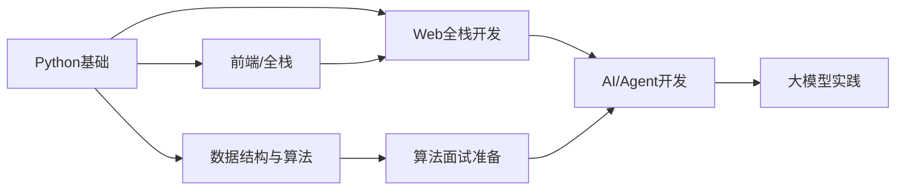

# 📚 GitHub 星标仓库总览

> 来源：[asdki6/learning](https://github.com/stars/asdki6/lists/learning) | 9 个星标仓库 | **85,818 行原始教学内容**

## 目录

- [[#教学型仓库（含完整教学内容）|📖 教学型仓库（含完整教学内容）]]
- [[#目录/工具型仓库|📋 目录/工具型仓库]]
- [[#统计|📊 统计]]

---

## 📖 教学型仓库（含完整教学内容）

这些仓库包含实际的教学内容，已在笔记中抓取了完整知识点：

| 仓库 | 教学内容 | ⭐ Stars | 笔记大小 |
|------|---------|---------|---------|
| [[stars/learning/coding-interview-university\|🎯 coding-interview-university]] | 算法、数据结构、系统设计完整学习计划 | 352,289 | 344 行 |
| [[stars/learning/python-100-days\|🐍 Python-100-Days]] | 100天 Python 从入门到大师（含代码示例） | 183,392 | 320 行 |
| [[stars/learning/dive-into-llms\|🤖 dive-into-llms]] | 11 章大模型教程（微调/Prompt/Safety/RLHF） | 40,921 | 255 行 |
| [[stars/learning/hello-agents\|🧠 hello-agents]] | 16 章智能体从零构建教程（含代码） | 59,437 | 250 行 |
| [[stars/learning/agency-agents\|🏢 agency-agents]] | 18 类 100+ AI Agent 定义与工作流程 | 113,491 | 205 行 |
| [[stars/learning/freecodecamp\|🎓 freeCodeCamp]] | 13 个认证、数千挑战、完整课程体系 | 447,872 | 153 行 |

## 📋 目录/工具型仓库

| 仓库 | 内容类型 | ⭐ Stars |
|------|---------|---------|
| [[stars/learning/build-your-own-x\|🔧 build-your-own-x]] | 从零实现技术的教程目录（50+ 主题） | 515,981 |
| [[stars/learning/developer-roadmap\|🗺️ developer-roadmap]] | 开发者路线图与学习资源导航 | 357,360 |
| [[stars/learning/project-based-learning\|📐 project-based-learning]] | 项目驱动的编程教程集合 | 269,546 |

---

## 📊 统计

- **总星数**: ⭐ 2,340,279
- **笔记总行数**: **85,818 行原始教学内容**
- **主要语言**: TypeScript, Python, Jupyter Notebook, Shell, Markdown

### 学习路线建议

1. 🐍 **Python 入门** → [[stars/learning/python-100-days|Python-100-Days]]
2. 🎯 **算法基础** → [[stars/learning/coding-interview-university|coding-interview-university]]
3. 🔧 **动手实践** → [[stars/learning/build-your-own-x|build-your-own-x]]
4. 🗺️ **选择方向** → [[stars/learning/developer-roadmap|developer-roadmap]]
5. 🧠 **AI时代** → [[stars/learning/hello-agents|hello-agents]] → [[stars/learning/dive-into-llms|dive-into-llms]]
