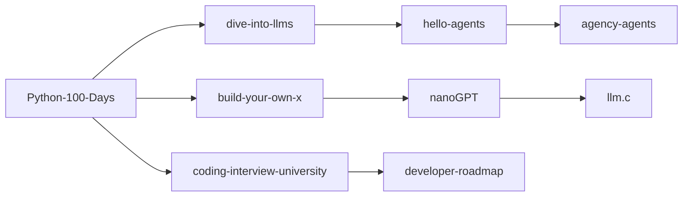

# GitHub Stars 学习索引

> 总计：11 个项目 | 总星标：2,599,403+ | 最后更新：2026-06-18

## AI / Agent 方向

| 项目 | 星标 | 一句话 |
|------|:----:|--------|
| [[agency-agents]] | 114k | 多 Agent 协作体系 |
| [[hello-agents]] | 60k | 从零构建智能体中文教程 |
| [[dive-into-llms]] | 41k | 动手学大模型实践教程 |

## 编程学习 / 项目实战

| 项目 | 星标 | 一句话 |
|------|:----:|--------|
| [[build-your-own-x]] | 517k | 从零重建核心技术 |
| [[project-based-learning]] | 270k | 项目驱动学习教程合集 |
| [[freeCodeCamp]] | 449k | 免费全栈编程课程 |
| [[Python-100-Days]] | 183k | Python 百天入门到大师 |

## 学习路线 / 方法论

| 项目 | 星标 | 一句话 |
|------|:----:|--------|
| [[developer-roadmap]] | 358k | 开发者成长路线图 |
| [[coding-interview-university]] | 353k | CS 自学与面试准备 |

## 底层实现 / 深度学习

| 项目 | 星标 | 一句话 |
|------|:----:|--------|
| [[llm.c]] | — | 纯 C 实现 LLM 训练 |
| [[nanoGPT]] | — | 最简 GPT 实现 |
| [[micrograd]] | — | 最简自动微分引擎 |
| [[nn-zero-to-hero]] | — | 神经网络从零到精通 |
| [[build-nanogpt]] | — | 跟着视频造 GPT |

## 学习路径建议

