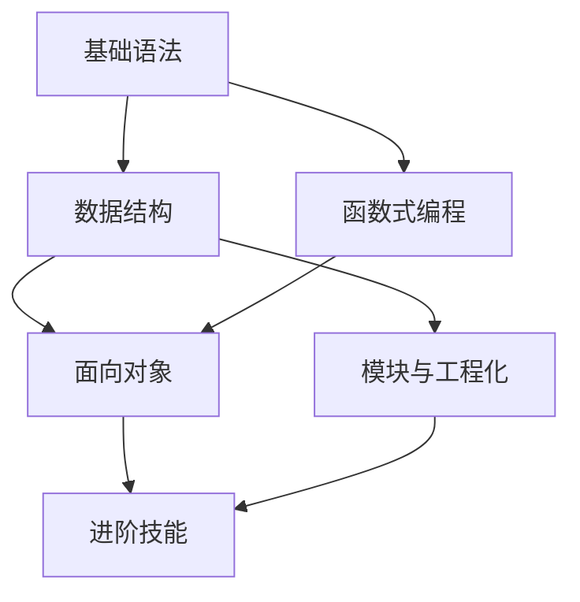

# 🐍 Python 学习路线图

> 基于 Learn Anything 技能生成 | 22 个核心概念 | 6 大领域

---

## 📊 学习进度

| 状态 | 数量 | 占比 |
|------|------|------|
| 🟢 已掌握 | 0 | 0% |
| 🔵 学习中 | 0 | 0% |
| 🟠 需练习 | 0 | 0% |
| ⚪ 未探索 | 22 | 100% |

---

## 🗺️ 知识地图

### 1. 基础语法 `basics`

| 概念 | 状态 | 子主题 |
|------|------|--------|
| 变量与数据类型 | ⚪ | int/float/str/bool、type()、变量命名 |
| 运算符与表达式 | ⚪ | 算术/比较/逻辑、优先级、海象运算符 `:=` |
| 控制流 | ⚪ | if/elif/else、for/while、break/continue |
| 字符串操作 | ⚪ | 切片与索引、常用方法、f-string |

### 2. 数据结构 `data-structures`

| 概念 | 状态 | 子主题 |
|------|------|--------|
| 列表与元组 | ⚪ | 增删改查、切片赋值、推导式、不可变性 |
| 字典与集合 | ⚪ | 键值对操作、集合运算、defaultdict/Counter |
| 推导式与生成器表达式 | ⚪ | 列表/字典/集合推导式、性能对比 |

### 3. 函数式编程 `functions`

| 概念 | 状态 | 子主题 |
|------|------|--------|
| 函数定义与参数 | ⚪ | 位置/关键字参数、*args/**kwargs、类型提示、闭包 |
| 装饰器 | ⚪ | 函数装饰器、带参数装饰器、functools.wraps |
| 迭代器与生成器 | ⚪ | iter/next 协议、yield、生成器管道、itertools |
| Lambda 与高阶函数 | ⚪ | lambda、map/filter/reduce、sorted key |

### 4. 面向对象编程 `oop`

| 概念 | 状态 | 子主题 |
|------|------|--------|
| 类与实例 | ⚪ | `__init__`、实例/类属性、self |
| 继承与多态 | ⚪ | 单/多继承、super()、MRO、鸭子类型 |
| 魔术方法 | ⚪ | `__str__`/`__repr__`、比较、上下文管理器 |
| 属性与描述符 | ⚪ | @property、getter/setter、`__slots__`、描述符 |

### 5. 模块与工程化 `modules-engineering`

| 概念 | 状态 | 子主题 |
|------|------|--------|
| 模块与包 | ⚪ | import 机制、`__init__.py`、相对/绝对导入 |
| 文件处理 | ⚪ | open/read/write、with、CSV/JSON、pathlib |
| 异常处理 | ⚪ | try/except/finally、自定义异常、traceback |
| 虚拟环境与包管理 | ⚪ | venv、pip、requirements.txt |

### 6. 进阶技能 `advanced`

| 概念 | 状态 | 子主题 |
|------|------|--------|
| 并发编程 | ⚪ | threading、multiprocessing、asyncio、GIL |
| 单元测试 | ⚪ | unittest、pytest、mock/patch、覆盖率 |

---

## 🎯 推荐学习顺序

1. **基础语法** → 变量与数据类型（基石）
2. **数据结构** → 列表、字典（最常用）
3. **函数式编程** → def、lambda、装饰器
4. **面向对象** → 类、继承、魔术方法
5. **模块与工程化** → 文件处理、异常、虚拟环境
6. **进阶技能** → 并发、测试

---

## 🛠️ 使用的命令

| 命令 | 用途 |
|------|------|
| `/learn:topic python` | 查看知识图谱 |
| `/learn:explain <概念>` | 深度讲解 |
| `/learn:practice <概念>` | 编码练习 |
| `/learn:review` | 进度回顾 |
| `/learn:status` | 知识热力图 |

---

## 📁 相关文件

- 数据文件: `.learn/topics/python/state.json`
- 会话笔记: `.learn/topics/python/sessions/`
- 练习代码: `.learn/topics/python/exercises/`
