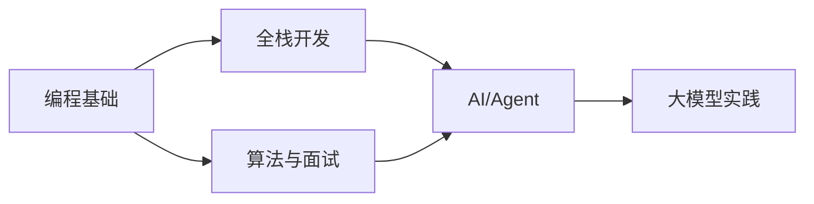

# 📚 GitHub 星标仓库 — Learning 列表

> 来源：[asdki6/learning](https://github.com/stars/asdki6/lists/learning) | 共 9 个仓库

## 概览

| 仓库 | 描述 | 语言 | ⭐ Stars | 主题标签 |
|------|------|------|---------|---------|
| [[stars/learning/project-based-learning\|project-based-learning]] | 项目驱动的编程教程集合 | - | 269,546 | #tutorial #python #project |
| [[stars/learning/developer-roadmap\|developer-roadmap]] | 开发者成长路线图 | TypeScript | 357,360 | #computer-science #roadmap |
| [[stars/learning/build-your-own-x\|build-your-own-x]] | 从零重建你喜爱的技术 | Markdown | 515,981 | #programming #tutorials #free |
| [[stars/learning/freecodecamp\|freeCodeCamp]] | 开源编程课程平台 | TypeScript | 447,872 | #learn-to-code #education |
| [[stars/learning/agency-agents\|agency-agents]] | AI Agent 代理工具集 | Shell | 113,491 | #ai #agent |
| [[stars/learning/coding-interview-university\|coding-interview-university]] | 计算机科学学习计划 | - | 352,289 | #interview #algorithms #study-plan |
| [[stars/learning/python-100-days\|Python-100-Days]] | Python 100天从新手到大师 | Jupyter Notebook | 183,392 | #python #tutorial |
| [[stars/learning/hello-agents\|hello-agents]] | 从零开始的智能体教程 | Python | 59,437 | #agent #llm #rag #tutorial |
| [[stars/learning/dive-into-llms\|dive-into-llms]] | 《动手学大模型》教程 | Jupyter Notebook | 40,921 | #llm #deep-learning |

## 统计

- **总星数**: ⭐ 2,340,279
- **主要语言**: TypeScript, Python, Jupyter Notebook, Shell, Markdown
- **分类**: 编程教程、AI/Agent、算法面试、全栈开发、大模型

## 学习路线建议

## 相关链接

- [[stars/learning/project-based-learning|project-based-learning]] — 动手实践 →
- [[stars/learning/developer-roadmap|developer-roadmap]] — 路线图导航 →
- [[stars/learning/build-your-own-x|build-your-own-x]] — 深入底层 →
- [[stars/learning/freecodecamp|freeCodeCamp]] — 系统性学习 →
